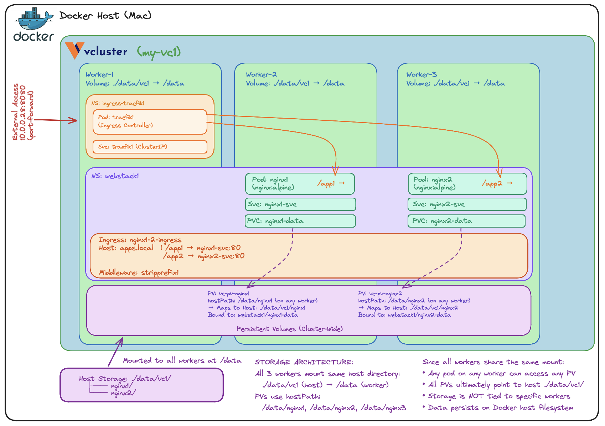
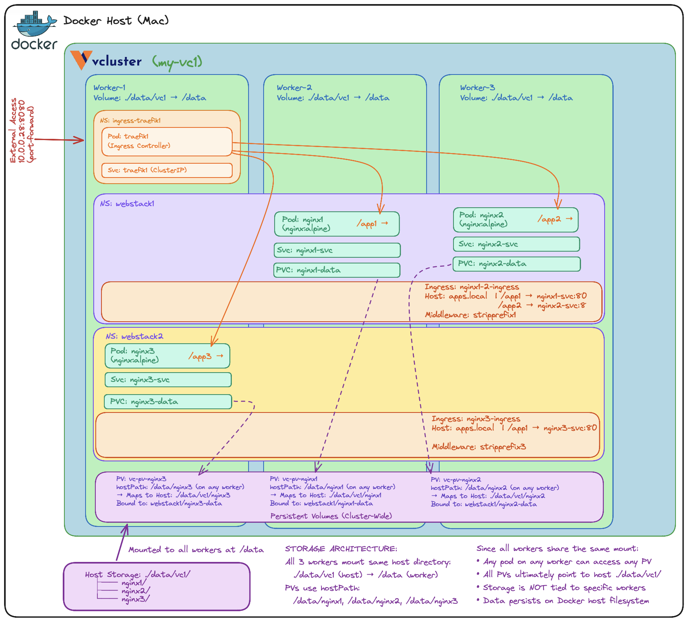
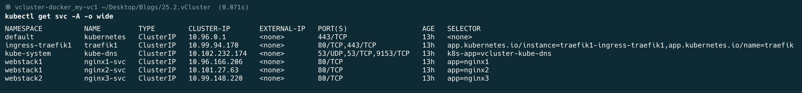
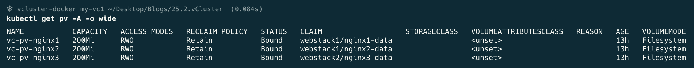
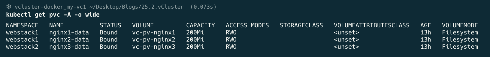
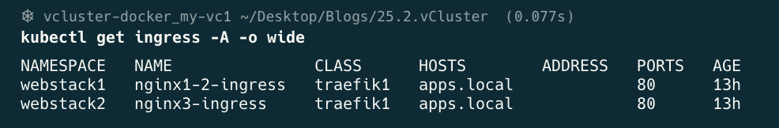
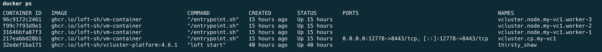

## How to: Web apps on Kubernetes deployed on vCluster, configured with Traefik App Proxy and Ingress Controllers

Welcome to [The Rabbit Hole](https://medium.com/@georgelza/list/the-rabbit-hole-0df8e3155e33)

The idea, how do we build out a Microservices development environment, enabling the devloper to be productive, locally, without access to a full enterprise hosted Kubernetes stack. This is always the cunandrum for developers when developing for container based deployment.

Introduce [vCluster](https://github.com/loft-sh/vcluster)... This allows us to run a virtual Kubernetes cluster inside [Docker](https://www.docker.com), mind you it allows you to run virtual Kubernetes clusters inside hosting Kubernetes clusters, inside namespaces. It enables you to significantly more than what I am showing here. 

### What is vCluster

As per the [Project](https://www.vcluster.com/docs/vcluster/introduction/what-are-virtual-clusters) web page:

>vCluster is an open source solution that enables teams to run virtual Kubernetes clusters inside existing infrastructure. It helps platform engineers create secure, isolated environments for development, testing, CI/CD, and even production workloads, without the cost or overhead of managing separate physical clusters.


THIS, what follows below, is for my use case...

Ok, so we demostrated vCluster in the previous [Blog](https://medium.com/@georgelza/exploring-vcluster-as-solution-to-running-k8s-locally-inside-docker-6ea233c67726) you would say, and you would be right, we only covered the basics. And thats it. It was really only the basics. 

**Lets now go a bit deeper.**

We want to model three applications, web pages or API apps (there is actually no difference here, they both listen for calls based on a URL/port using http/https). 

Our design will be:

- Single shared Traefik Application Proxy 
- **App1** and **App2** will be in the same namespace (`webstack1`) and will be sharing a Ingress Controller, with separate (two) access paths
- **App3** will be in a second/separate namespace (`webstack2`) and will have a dedicated Ingress Controller, with separate (3rd) access path

The apps will be able to be migrated across the Kubernetes nodes, so we need to consider [Persistent Volume (PV)](https://kubernetes.io/docs/concepts/storage/persistent-volumes/) and PVC's design. See: **Storage Architecture** section below.

### App1, App2 - Deployed in shared namespace, using single Traefik Application Proxy and single Ingress Controller




### App1, App2 and App3 - Deployed two namespaces, using single Traefik Application Proxy's and two Ingress Controllers


 App3" width="450" height="350">


The examples here are not [vCluster](https://github.com/loft-sh/vcluster) specific, it's more generic Kubernetes, but it shows how we can utilise [vCluster](https://github.com/loft-sh/vcluster) on local desktop/laptop running inside Docker. 

by doing this we're providing the developer with a local developement environment to develope and test in vs using a single [Docker](https://www.docker.com) or [docker-compose](https://docs.docker.com/compose/) environment.

I'm not against Docker-Compose, it's an amazing stack and I use it extensively myself, it's simple, and easy to use to deploy as part of a demo, but for artifacts to be produced, to be deployed into a production like K8S environment, as part of a project deliverables, there are gaps, which by using K8S on [vCluster](https://github.com/loft-sh/vcluster) on Docker we can solve for the developer.

You can even run them side by side (Kubernetes on [vCluster](https://github.com/loft-sh/vcluster) next to [docker-compose](https://docs.docker.com/compose/)) if you really want to ;)

Now, I'm not ignoring that there are other ways/solutions to do this, but for me, [vCluster](https://github.com/loft-sh/vcluster) is attractive.

Blog: [How to: Web apps on Kubernetes deployed on vCluster, configured with Traefik App Proxy and Ingress Controllers](https://medium.com/@georgelza/how-to-web-apps-on-kubernetes-deployed-on-vcluster-configured-with-traefik-app-proxy-and-ingress-c79cfea7111c)

### Storage Architecture (Critical):

This is probably one of the most critical concepts in the world of Kubernetes (K8s). Kubernetes work with the concept that containers are immutable, aka cannot be changed. All data that the container reads and writes is located in a PVC.
As you will see below, All three workers have a **`/data`** directory (which is shared across the cluster), which originates from the host from **`./data/vc1`**. 
This enables a container to be shut down on one node and restarted on another and then get access back to the data it previously worked on.
The data resides inside Persistent Volume Claim (PVC's) owned by the container, which is allocated from a K8s resource: [Persistent Volume (PV)](https://kubernetes.io/docs/concepts/storage/persistent-volumes/). The PV/PVC need to be accessible across the nodes of a K8s cluster to enable the container to be spun up on any node and be able to connect to it's assigned PVC.

> You would be well advised to spend a fair amount of time getting familiar with storage, PV, PVC's, classes etc and how they are provisioned for K8S clusters.


Below you can see each node has a volumes property where we map the host **`./data/vc1`** (./data is my local directory, vc1 is for this cluster, I have multiple clusters running at the same time) directory into the node/container into a common directory, **`/data`**.

```yaml
# vcluster.yaml
# https://github.com/loft-sh/vind/blob/main/docs/configuration.md
# Kubernetes version (optional, defaults to v1.35.0)
controlPlane:
  distro:
    k8s:
      version: "v1.35.0"
  backingStore:
    etcd:
      embedded:
        enabled: true

experimental:
  docker:
    # Environment variables
    env:
      - "CLUSTER_NAME=my-vc1"
      - "ENVIRONMENT=development"

    nodes:
    - name: "worker-1"
      volumes:
        - "./data/vc1:/data"
      env:
        - "NODE_ROLE=worker"
        - "NODE_LABEL=worker"

    - name: "worker-2"
      volumes:
        - "./data/vc1:/data"
      env:
        - "NODE_ROLE=worker"
        - "NODE_LABEL=worker"

    - name: "worker-3"
      volumes:
        - "./data/vc1:/data"
      env:
        - "NODE_ROLE=worker"
        - "NODE_LABEL=worker"
```

Each pod/deployment is then allocated a dedicated [Persistent Volume (PV)](https://kubernetes.io/docs/concepts/storage/persistent-volumes/).

```bash
Local host ./data/vc1/nginx1 mapped to /data/nginx1/ as pv vc-pv-nginx1
Local host ./data/vc1/nginx2 mapped to /data/nginx2/ as pv vc-pv-nginx2
Local host ./data/vc1/nginx3 mapped to /data/nginx3/ as pv vc-pv-nginx3
```


Each pod/deployment then claims storage aka PVC which consumes storage from the PV which is referred to as cluster resource, the PVC reside insame namespace as the app/pod (PV's are global).

```bash
ns: webstack1 for vc-pvc-nginx1 inside vc-pv-nginx1
ns: webstack1 for vc-pvc-nginx2 inside vc-pv-nginx2
ns: webstack2 for vc-pvc-nginx3 inside vc-pv-nginx3
```

Using the above pattern the pod's can move across the cluster onto any worker and still have access to its data by accessing it's PVC.

NOTE: was the above to be done on a Kubernets environment, deployed on anything other than vCluster/Docker then the Kubernetes would need access to a shared file system/volume across the nodes, a file system that is cluster aware, mountable across multiple hosts concurrently, i.e. [CEPHFS](https://ceph.io/en/), etc.


## Basic Installation/HOST Preperation

1. Install vCluster

```bash
# Insall vCluster on Apple MAC
brew install vcluster

# Upgrade vCluster CLI to the latest version
vcluster upgrade --version v0.32.0

# Set Docker as the default driver
vcluster use driver docker

# Start vCluster Platform (optional but recommended)
vcluster platform start
```


## Deployment and Building Our Examples

We have this **README.md** files, covering the overview and then **Deploy_1.md** and **Deploy_2.md** covering the steps required to stand up the 2 environments as described above.

- See `Deploy_1.md` - Two web based apps in same Namespace, Single Traefik Application Proxy and sharing single Ingress Controller

- See `Deploy_2.md` - Three web based apps in two Namespaces, with Single Traefik Application Proxy and two Ingress Controllers

**Do take note of the notes at the bottom of Deploy_1.md and Deploy_2.md.**

### Full Deployment: Deploy_2.md

Pods:


Services:



PV:



PVC:



Ingress:



Our Docker Stack:




BLOG: [Exploring K8S on vCluster, Web App's, Traefik Application Proxy and Ingress Controllers](???)

GIT: [Exploring_vCluster_with_apps_and_ingress_controllers](https://github.com/georgelza/Exploring_vCluster_with_apps_and_ingress_controllers.git)


## vCluster Project Pages

- [vCluster](https://github.com/loft-sh/vcluster)

- [Full Quickstart Guide](https://www.vcluster.com/docs/vcluster/#deploy-vcluster)

- [Slack Seerver](https://slack.loft.sh/)

- [VIND](https://github.com/loft-sh/vind)


## Supporting Background Information

- [Traefik Application Proxy on Kubernetes](https://traefik.io/traefik)

- [CEPHFS as Cluster aware file system for Kubernetes](https://ceph.io/en/)
  
## THE END

And like that we’re done with our little trip down another Rabbit Hole, Till next time.

Thanks for following. 

Whats next… Hmm, thinking of maybe taking this stack and adding some observability tooling… [Prometheus](https://prometheus.io)/[Grafana](https://grafana.com)/[Elastic](https://www.elastic.co)

### The Rabbit Hole


## ABOUT ME

I’m a techie, a technologist, always curious, love data, have for as long as I can remember always worked with data in one form or the other, Database admin, Database product lead, data platforms architect, infrastructure architect hosting databases, backing it up, optimizing performance, accessing it. Data data data… it makes the world go round.
In recent years, pivoted into a more generic Technology Architect role, capable of full stack architecture.

### By: George Leonard

- georgelza@gmail.com
- https://www.linkedin.com/in/george-leonard-945b502/
- https://medium.com/@georgelza


